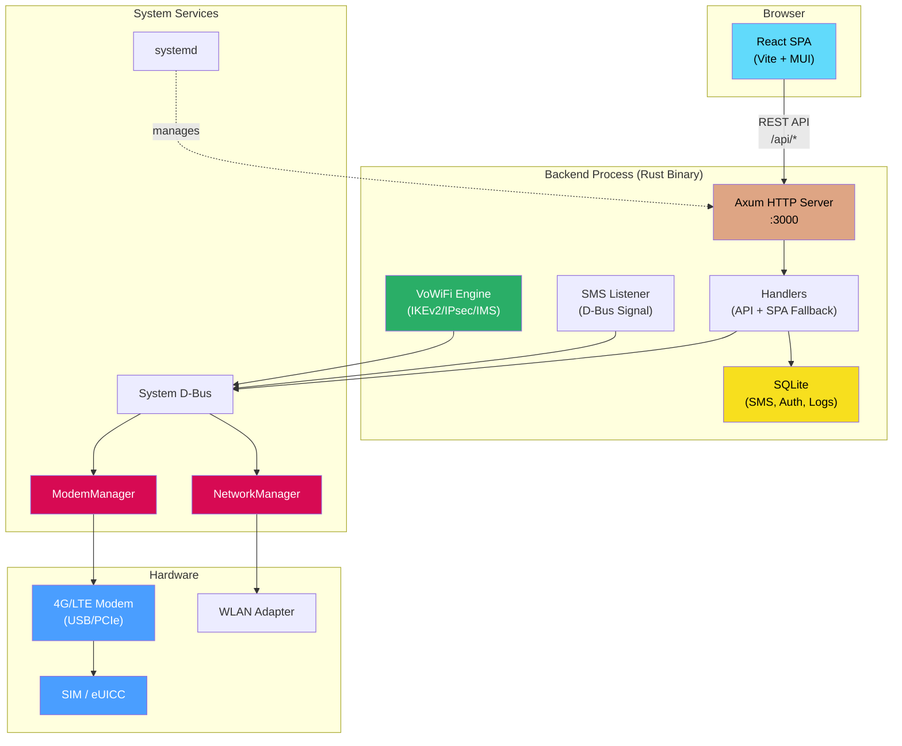
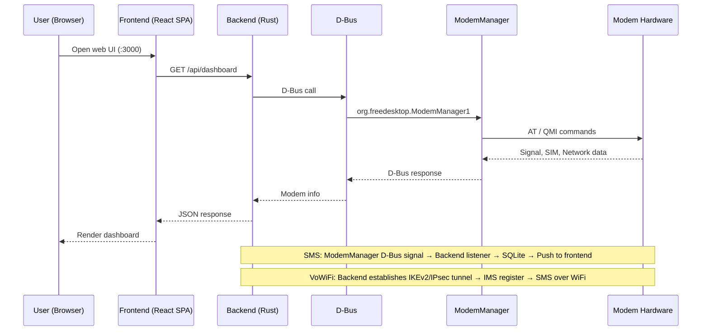

<div align="center">
  <br/>

  <p>Web-based SIM/eSIM management system for Linux cellular CPEs, portable Wi-Fi hotspots, and software routers. Comprehensive control over SIM/eSIM cards, cellular networks, SMS, DDNS, device status, and OTA updates.</p>

  <p>
    <a href="https://github.com/voorz/SimAdmin"></a>
    <a href="./LICENSE"></a>
    
    <a href="https://github.com/voorz/SimAdmin/releases"></a>
    <a href="https://github.com/voorz/SimAdmin/releases"></a>
    <a href="https://github.com/voorz/SimAdmin/actions"></a>
  </p>

</div>

## Overview

**Key Highlight — VoWiFi (WiFi Calling) Support**: Native IKEv2/IPsec implementation with zero external dependencies. Uses SIM hardware authentication to establish encrypted tunnels, enabling IMS registration and secure SMS even without cellular signal or in airplane mode.

The project consists of a Rust backend and a React frontend:

- **Backend**: Rust + Axum + zbus, communicates with ModemManager via D-Bus, with fallbacks to `mmcli` and `qmicli` or direct AT commands.
- **Frontend**: React + Vite + Material UI, providing dashboard, SIM management, cellular network, device network, SMS, notification center, automation, and OTA update pages.
- **Deployment**: The backend binary serves the frontend SPA in-process. Installed to `/opt/simadmin`, managed by systemd.

Health checks are designed for Linux cellular devices with ModemManager support. Different modem firmware, kernels, and ModemManager versions expose different capabilities — actual features depend on your hardware.

### Quick Start

> Auto-detects architecture (arm64 / amd64 or WSL), installs system dependencies, configures systemd service — all in one command.

```bash
curl -fsSL https://raw.githubusercontent.com/voorz/SimAdmin/main/install_latest.sh | sh
```

- **Target archs**: `aarch64-unknown-linux-musl` / `x86_64-unknown-linux-musl` (static binary, no glibc dependency)
- **Install path**: `/opt/simadmin/` (binary + `www/` + `data.db`)
- **Service**: `systemd` (`simadmin.service`)
- **Access**: `http://<device-ip>:3000`

## Documentation

- **[Installation & Deployment](./docs/install.md)** — One-click install/uninstall, default access address, and initial admin password setup.
- **[Changelog](./docs/changelog.md)** — Detailed version history and update notes.
- **[Environment & System Management](./docs/environment.md)** — Hardware requirements, dependencies, install paths, eSIM management, systemd service, and data persistence.
- **[Developer Guide](./docs/developer.md)** — Project structure, frontend/backend development, OTA build, ADB deployment, and D-Bus interface reference.
- **[REST API Documentation](./bruno-api/README.md)** — REST API route map, request/response schemas, and Bruno API debugging collections.

## Architecture

### System Requirements

**Supported OS**: Debian 11+, Ubuntu 20.04+, or any Linux distribution with:

- **systemd** — service management
- **D-Bus** — IPC bus for ModemManager and NetworkManager
- **ModemManager** + `mmcli` — modem abstraction layer
- **NetworkManager** + `nmcli` — network management

> SimAdmin communicates with modems through ModemManager's D-Bus API, not via direct AT commands.
> This is why Debian/Ubuntu (which ship these services by default) are the primary targets.
> Distributions without these services (e.g. OpenWrt, Alpine) require significant adaptation.





## Development

### Prerequisites

- [Rust](https://rustup.rs/) (stable toolchain)
- [Node.js](https://nodejs.org/) 20+ and [pnpm](https://pnpm.io/) 9
- System D-Bus, ModemManager, NetworkManager (for hardware interaction)

## Disclaimer

This project directly operates cellular modems, SIM registration, data dialing, APN, frequency bands, airplane mode, NetworkManager, systemd services, system reboots, and OTA file replacement. iptables/ip6tables are used for read-only network diagnostics only and will not automatically clear host firewall rules.

Use only on devices you own and control. Misconfiguration may result in network disconnection, SIM roaming charges, or service failure requiring manual recovery. The user assumes all responsibility for any consequences arising from the use of this project.

Some interfaces are limited by hardware and ModemManager capabilities:

- Band locking depends on ModemManager's `SupportedBands` / `CurrentBands` / `SetCurrentBands`.
- Cell locking is currently an in-memory display only and does not send real hardware lock commands.

## License

This project is licensed under the GNU General Public License v3.0 (GPLv3).

## Features

### Web Management Pages

| Page | Route | Description |
|------|-------|-------------|
| Login | `/login` | Initial admin password setup and login |
| Dashboard | `/` | Online status, carrier, signal, latency, quick toggles, system resources, temperature, traffic, and device info |
| SIM Management | `/sim` | SIM status, identifiers, unlock counters, phone number & SMSC editing, eSIM profile management |
| Cellular Network | `/network` | Network registration, serving/neighbor cells, operator scan, APN, radio mode, band locking |
| Device Network | `/device-network` | WLAN client connectivity, wireless scanning, DDNS configuration and sync logs |
| SMS | `/sms` | Send/receive SMS, conversation view, statistics, delete |
| Notifications | `/notifications` | Forwarding logs, rules, channels, multi-channel test sending |
| Automation | `/automation` | Task scheduling, execution logs with search and cleanup |
| Configuration | `/config` | System settings, data connection, roaming, airplane mode |
| Security | `/config/security` | Admin password, password policy, login protection, session timeout |
| OTA Update | `/ota` | Upload OTA package, fetch releases, verify, apply or cancel |

### Backend Capabilities

- Single-admin authentication with first-time setup, session cookies, protected API interception, and SSH recovery.
- Device info, SIM info, and network registration readout.
- Data connection toggle and roaming policy persistence.
- Airplane mode control.
- Baseband reboot flow with progress tracking.
- Data connection watchdog (15-second interval): checks connection status, iptables rules, and modem availability. Detects host firewall rules without clearing them.
- ModemManager loss recovery via `mmcli --scan-modems`, with ModemManager restart on consecutive failures.
- NetworkManager `wwan*` unmanaged configuration.
- WLAN client management via NetworkManager/nmcli, with WLAN prioritized as default route when online.
- Native DDNS sync supporting Tencent Cloud DNSPod, Alibaba Cloud AliDNS, and Cloudflare, with independent IPv4/IPv6 configuration.
- SMS send/receive, SQLite persistence, and multi-channel notification forwarding.
- Dual-track automation task scheduler: fixed-time (weekly + specific time) and interval-based (minutes/hours/days).
- Automation actions: baseband reboot, safe system reboot (with delay), SMS sending (with random delay, anti-intercept random content, and failure retry).
- Automation event notifications and execution logs with SQLite storage, keyword search, date filtering, and cleanup policies.
- APN list read and modification.
- Operator list, scan, manual/automatic registration.
- eSIM mode: on-demand `lpac` integration for eUICC profile management; inactive in normal SIM mode.
- OTA upload, online download, verification, binary and frontend resource replacement.

## References

- [project-cpe](https://github.com/1orz/project-cpe)
- [SmsForwarder](https://github.com/pppscn/SmsForwarder)
- [ddns-go](https://github.com/jeessy2/ddns-go)
- [lpac](https://github.com/estkme-group/lpac)
